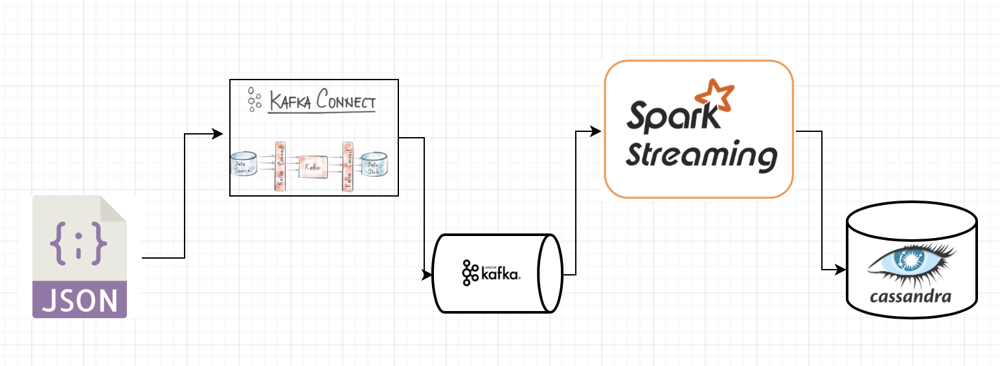

## Design

## Versions

- scala 2.11
- spark 2.3
- kafka 0.10
- cassandra 3.10

## Data generation

Write log for 1 bot, 1000 users, 100 requestes/sec, duration 300 seconds:    

    python3 botgen.py -b 1 -u 1000 -n 100 -d 300 -f data.json
    
## Running locally

    docker run --name some-cassandra -d cassandra:3.10